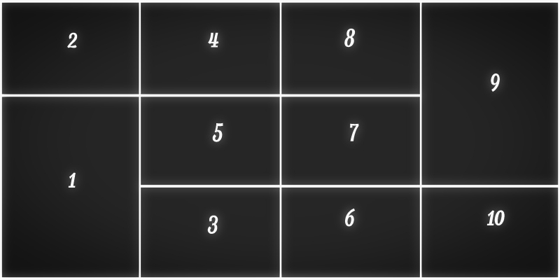

# Flicket

## About

Flicket is a ruby command line tool that:

  * accepts a list of search keywords as arguments
  * queries the Flickr API for the top-rated image for each keyword
  * downloads the results
  * crops them rectangularly
  * assembles a collage grid from ten images and
  * writes the result to a user-supplied filename

If given less than ten keywords, or if any keyword fails to
result in a match, it retrieves random words from a dictionary
source such as `/usr/share/dict/words`. Repeating as necessary
until you have gathered ten images.

## Installation

```
git clone https://github.com/madis/flicket.git
cd flicket
bundle install
rake build
gem install pkg/flicket.gem
```

## Usage

1. Obtain flickr API key from https://www.flickr.com/services/apps/create/apply
2. Export them as environment variables
```bash
export FLICKR_KEY=xxxxxxxxxxxxxxxxxxxxxxxxxxxxxxxx # Replace with your key
export FLICKR_SECRET=xxxxxxxxxxxxxxxx # Replace with your secret
```

3. After building and installing the gem: `flicket [keyword ...]`
4. Or inside the gem's source folder (after installing dependencies with `bundle install`): `./bin/flicket [keyword ...]`

> NB! Output filename can be provided with `--output or -o` e.g. `flicket -o mycollage.png tree river bratwurst`

## Development

Most of the code is covered with tests using RSpec. [VCR](https://github.com/vcr/vcr) is used to avoid hitting Flickr api every time and to speed up tests.

[ImageMagick](http://www.imagemagick.org/) must be installed too. On OS X it can be done with Homebrew `brew install imagemagick`.


1. Clone the repo `git clone https://github.com/madis/flicket`
2. Install dependencies `cd flicket && bundle install`
3. Run tests `rspec`


## Layouts

Layouts can be defined in LayoutCalculator. Example layout is defined.

```ruby
LAYOUT = [
  [0,1,2,3],
  [4,5,6,3],
  [4,7,8,9]
]
```




The numbers in the matrix are *cell names*. To mark bigger cell, e.g. cell **4** that is double the height of single cell, use same name in consequtive rows. Layout calculator will crop and resize automatically

> NB The LayoutCalculator may not handle more complex layouts correctly in its initial incarnation. It is mainly here as a starting point and a direction for future development.
